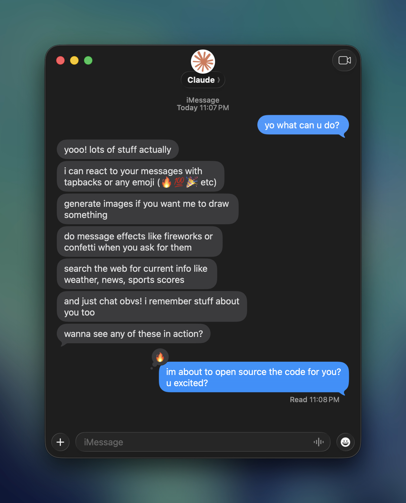

# Linq AI Agent Example



**Try it yourself!** Text **[+1 (415) 870-7772](sms:+14158707772)** to chat with Claude Sullivan, our AI agent running on the Linq Blue API.

A demo app showcasing the [Linq Blue v3 API](https://apidocs.linqapp.com). Connects Claude (Anthropic's AI) to iMessage, allowing users to chat with an AI assistant via text message.

## Features

- **Claude AI responses** - Conversational AI via iMessage
- **Web search** - Real-time info (weather, news, sports, etc.)
- **Image generation** - Ask Claude to draw/create images via DALL-E 3
- **Image analysis** - Send photos and Claude describes/analyzes them
- **iMessage reactions** - Claude can react with tapbacks OR any custom emoji
- **iMessage effects** - Screen effects (fireworks, confetti) or bubble effects (slam, loud)
- **Typing indicators** - Shows typing while Claude thinks
- **Voice memo transcription** - Transcribes voice memos via OpenAI Whisper
- **Conversation memory** - Remembers context per chat (1 hour TTL)
- **User profiles** - Remembers names and facts about people permanently
- **Group chat awareness** - Detects group chats and adjusts behavior
- **Smart group chat filtering** - Uses Haiku to determine if Claude should respond, react, or ignore
- **Group chat renaming** - Claude can rename group chats when asked
- **Group chat icons** - Claude can generate and set group chat icons
- **Multi-message responses** - Sends multiple short messages like a human would
- **Message threading** - Continues conversation threads when users reply
- **Platform awareness** - Knows if conversation is iMessage, RCS, or SMS

## Quick Start

1. Copy `.env.example` to `.env` and fill in your keys

2. Install dependencies:
   ```bash
   npm install
   ```

3. Start the app:
   ```bash
   npm run dev
   ```

4. Expose locally with ngrok:
   ```bash
   ngrok http 3000
   ```

5. Configure the ngrok URL as your webhook in Linq Blue, then text your Linq Blue number!

## Configuration

Environment variables in `.env`:

| Variable | Description |
|----------|-------------|
| `ANTHROPIC_API_KEY` | Claude API key from Anthropic |
| `OPENAI_API_KEY` | OpenAI API key for Whisper (voice) and DALL-E (images) |
| `LINQ_API_TOKEN` | Linq Blue partner API token |
| `LINQ_API_BASE_URL` | Linq API base URL (default: https://api.linqapp.com/api/partner/v3) |
| `PORT` | Server port (default: 3000) |
| `LINQ_AGENT_BOT_NUMBERS` | Linq Blue phone numbers this bot runs on (comma-separated) |
| `IGNORED_SENDERS` | Sender numbers to skip (comma-separated) |
| `ALLOWED_SENDERS` | If set, only respond to these senders (for local dev) |
| `NODE_ENV` | Set to `production` to disable debug logging |
| `DYNAMODB_TABLE_NAME` | DynamoDB table for conversation storage |

## Commands

Users can send these commands via iMessage:
- `/clear` - Clear conversation history (start fresh)
- `/forget me` - Erase user profile (name + facts Claude has learned)
- `/help` - Show available commands

## Linq Blue API Endpoints Used

| Endpoint | Purpose |
|----------|---------|
| `POST /v3/chats/{chatId}/messages` | Send a message |
| `POST /v3/chats/{chatId}/read` | Mark chat as read |
| `POST /v3/chats/{chatId}/typing` | Start typing indicator |
| `DELETE /v3/chats/{chatId}/typing` | Stop typing indicator |
| `POST /v3/messages/{messageId}/reactions` | Add reaction to message |
| `POST /v3/chats/{chatId}/share_contact_card` | Share contact card |
| `GET /v3/chats/{chatId}` | Get chat info (for group detection) |
| `PUT /v3/chats/{chatId}` | Update chat (rename group, set icon) |

## Webhook Events Handled

| Event | Description |
|-------|-------------|
| `message.received` | Incoming message from user |
| `message.sent` | Confirmation message was sent |
| `message.delivered` | Message delivered to recipient |

## Claude Tools

The Claude integration uses these tools:

1. **send_reaction** - Sends iMessage reactions (standard tapbacks OR any custom emoji)
2. **send_effect** - Sends iMessage effects with the response
3. **rename_group_chat** - Renames the current group chat when asked
4. **remember_user** - Saves name and facts about people (persists forever)
5. **generate_image** - Generates images via OpenAI DALL-E 3
6. **set_group_chat_icon** - Generates and sets the group chat icon
7. **web_search** - Searches the web for current information

### Message Effects

Claude can send messages with iMessage effects:

**Screen Effects** (full-screen animations):
- confetti, fireworks, lasers, balloons, sparkles, celebration, hearts, love, happy_birthday, echo, spotlight

**Bubble Effects** (message animations):
- slam (impact), loud (big text), gentle (soft), invisible_ink (hidden until swiped)

## Architecture

```
[User] --iMessage--> [Linq Blue] --webhook--> [This App] --API--> [Claude]
                                                   |                  |
                                                   |    <-- tools <---|
                                                   |    (reactions,   |
                                                   |     web search,  |
                                                   |     images)      |
                                                   |                  v
                                                   |              [OpenAI]
                                                   |              (DALL-E, Whisper)
                                                   v
[User] <--iMessage-- [Linq Blue] <--API-------- [Reply + Images + Reactions]
```

### Flow

1. User sends iMessage to Linq Blue number
2. Linq sends `message.received` webhook
3. App marks chat as read + starts typing + gets chat info (parallel)
4. App detects if group chat (>2 participants)
5. **If group chat**: Uses Haiku to check if Claude should respond
6. App sends message + images + chat context to Claude API
7. Claude may use tools (web search, reactions, effects, image generation)
8. App sends text response back via Linq API
9. User receives iMessage reply

### Group Chat Smart Filtering

In group chats, Claude doesn't respond to every message. A fast Haiku call determines what Claude should do:

**Three possible actions:**
1. **respond** - Send a full text reply
2. **react** - Just send a tapback reaction
3. **ignore** - Do nothing

**Will respond:**
- Direct mentions: "claude", "@claude", "hey Claude"
- AI references: "hey AI", "ask the bot"

**Will react (but not respond):**
- Positive feedback: "awesome", "haha", "thanks!"

**Will ignore:**
- Casual human-to-human banter
- Messages addressed to specific people who aren't Claude

## File Structure

```
src/
├── index.ts              # Express app, webhook handler, main flow
├── claude/
│   └── client.ts         # Claude API integration, tools, system prompt
├── linq/
│   └── client.ts         # Linq Blue API functions
├── webhook/
│   ├── handler.ts        # Webhook processing, phone filtering
│   └── types.ts          # TypeScript types for webhook events
└── state/
    └── conversation.ts   # DynamoDB storage (conversations + user profiles)
```

## DynamoDB Schema

### Conversations (`CHAT#<chatId>`)
Stores message history per chat. TTL: 1 hour.

```json
{
  "pk": "CHAT#<chat-uuid>",
  "messages": [
    { "role": "user", "content": "hey", "handle": "+1234567890" },
    { "role": "assistant", "content": "hey! whats up?" }
  ],
  "lastActive": 1737676147,
  "ttl": 1737679747
}
```

### User Profiles (`USER#<handle>`)
Stores persistent info about people. No TTL - kept forever.

```json
{
  "pk": "USER#+1234567890",
  "handle": "+1234567890",
  "name": "John",
  "facts": ["Loves hiking", "Works in tech"],
  "firstSeen": 1737676147,
  "lastSeen": 1737679747
}
```

## Deployment

### Docker

```bash
# Build
docker build -t linq-blue-agent .

# Run
docker run -p 3000:3000 --env-file .env linq-blue-agent
```

## Models Used

- **Main responses**: Claude Sonnet 4 - balanced quality and speed
- **Group chat filtering**: Claude Haiku 3.5 - fast/cheap for quick decisions

## API Documentation

Full API documentation and OpenAPI spec available at: **https://apidocs.linqapp.com**

## License

MIT
